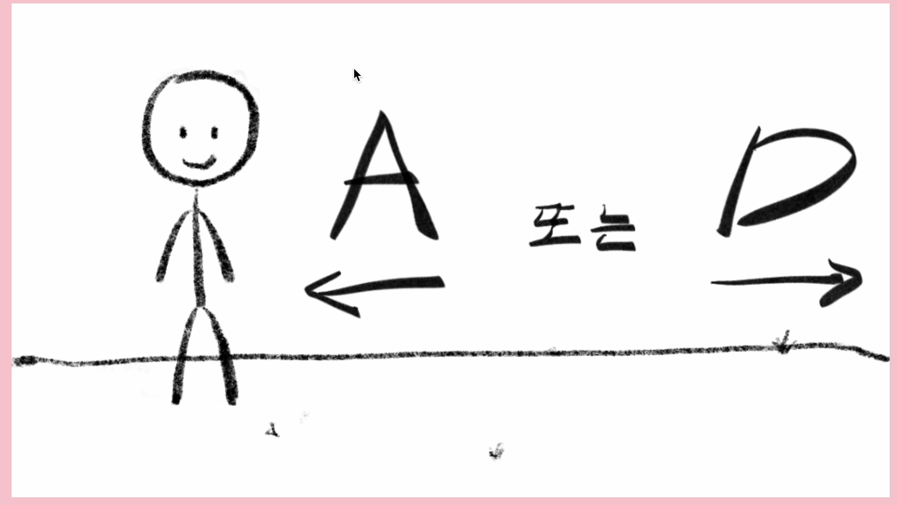
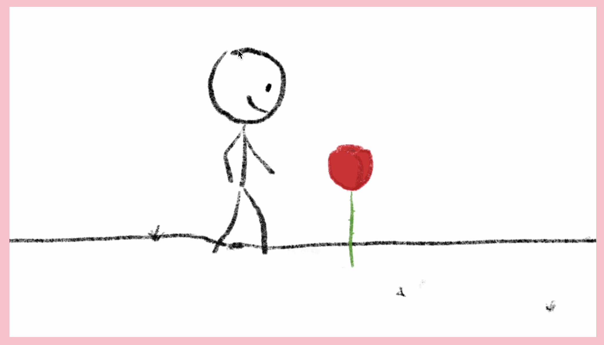
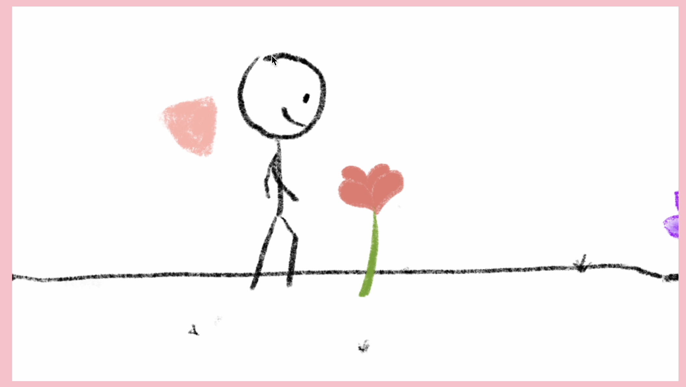
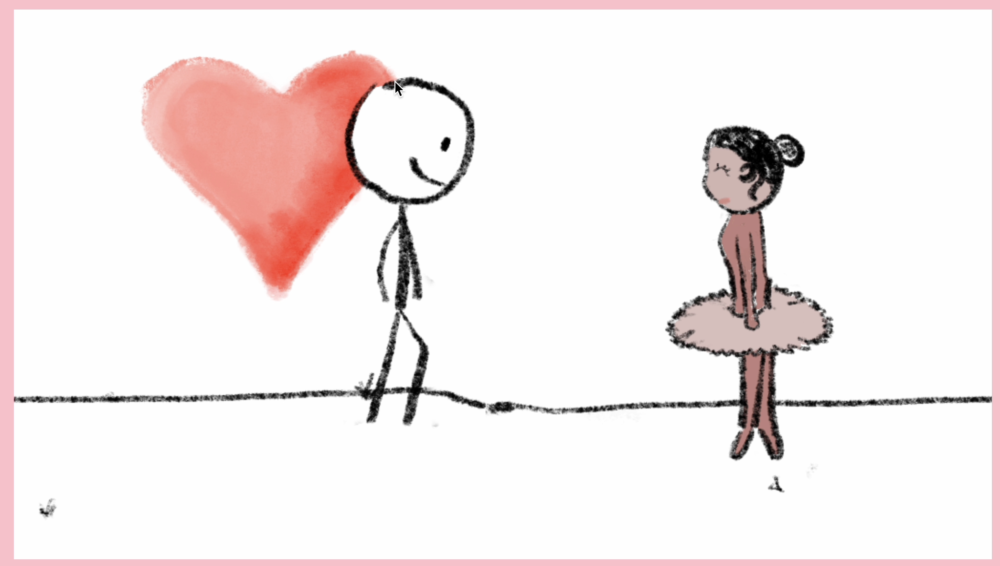
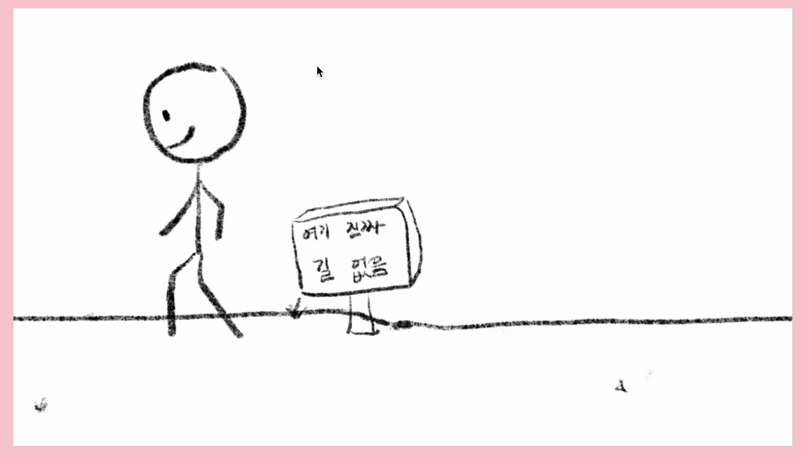
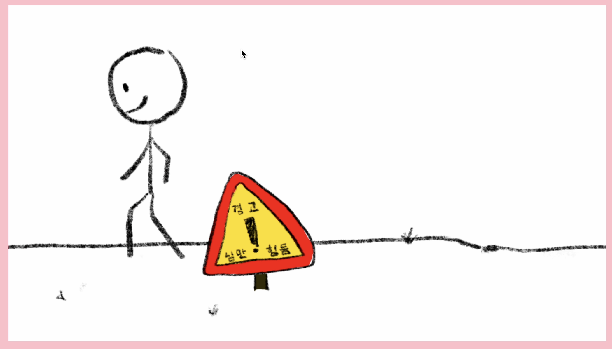
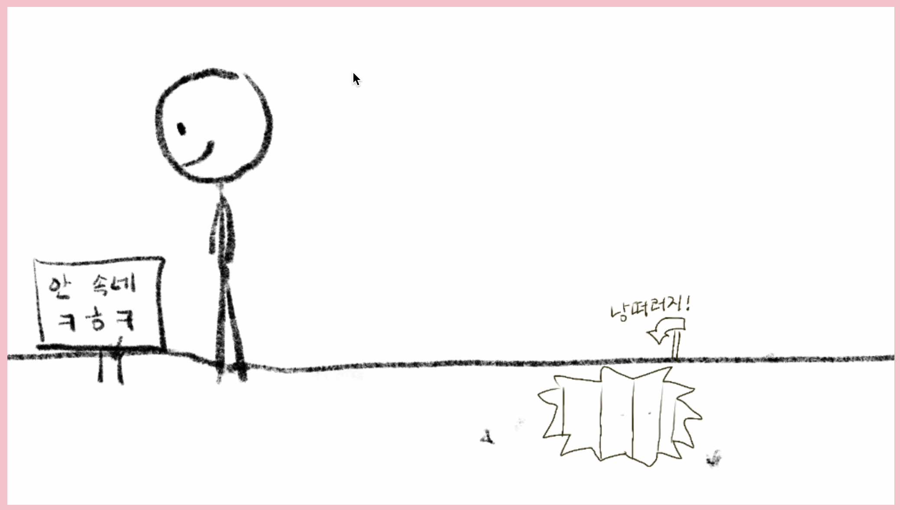
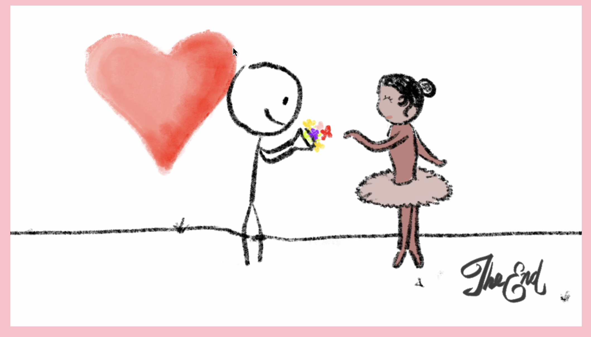

# 개요

- 이름 : theFlower
- 제작기간: 3일
- 게임방식 : 왼쪽, 오른쪽 방향키(혹은 A,D)로 컨트롤.
- 특징:
  - Canvas API 활용
  - 게임 엔진 없이 Vanilla javascript로 작성
  - 그림 에셋 직접 제작
- 게임적 요소:
  - 방향키를 움직임과 동시에 게임이 시작, 배경음이 재생됨
  - 꽃에 닿으면 하트가 차도록 함
  - 마지막에 도착했을 때 엔딩 메세지가 나옴
  - 반대쪽으로 간 경우 경고 팻말이 나옴

# 게임 영상

https://drive.google.com/file/d/12AydnB6oZPBaxOvwER48PVZ6E8mRIceQ/view?usp=drive_link

# 게임 화면

<table>
  <tr>
    <td></td>
    <td></td>
  </tr>
  <tr>
    <td></td>
    <td></td>
  </tr>
  <tr>
    <td></td>
    <td></td>
  </tr>
  <tr>
    <td></td>
    <td></td>
  </tr>
</table>

# 구현 방법

## 클래스 정의

### Loop Image

- 배경을 포지션 이동에 따라 반복적으로 제공하기 위한 클래스

### Sprite

- 총 Sprite Frame이 주어지고, Canvas Frame 증가에 따라 sprite frame을 증가후 모듈러 연산을 통해 반복함. 이미지로 표현되는 모든 클래스가 상속함

### Object

- Character : 캐릭터
- Point : 꽃을 먹을 때마다 커지는 하트
- Flower : 꽃
- Sign : 팻말

### Manager

- Flowers : 꽃의 생성과 충돌, 삭제를 관리. 셋팅값을 포함함
- Signs : 팻말의 생성을 관리. 셋팅값을 포함함

## 게임 루프(index.js)

- HTML EventListener로 key를 입력받아 게임 실행, 및 조작
- 게임 실행 state를 통해 게임이 실행중일 때 다시 실행되지 않도록 함.
